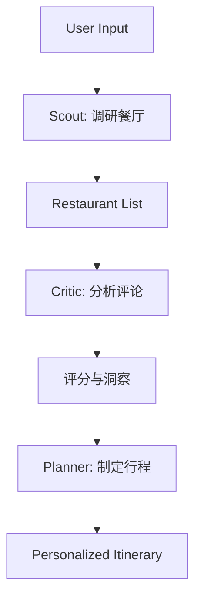

# 4️⃣ 工作流与多 Agent 编排 / Workflow & Multi-Agent Orchestration

> AI Agent 工作流编排框架与食品领域多 Agent 项目。

## 概览 / Overview

| 项目 | ⭐ | 类型 | 场景 |
|---|---:|---|---|
| [langchain-ai/langgraph](#1-langgraph) | 35k★ | 编排框架 | stateful agent 通用底座 |
| [FoundationAgents/AFlow](#2-aflow) | 536 | 自动化框架 | MCTS 自动发现 agent 工作流 |
| [vonzosten/awesome-LangGraph](#3-awesome-langgraph) | - | 资源索引 | LangChain 生态资源 |
| [akshaykarthicks/FoodCatalyst](#4-foodcatalyst) | - | CrewAI 项目 | 餐厅发现 Scout/Critic/Planner |
| [NUS-AIS-Practice-Modules/WhatsEat](#5-whatseat) | - | LangGraph 项目 | 餐厅推荐 supervisor 多 Agent |
| [shashanksrajak/chatbot-agent-food-ordering](#6-annapurna) | - | LangGraph + FastAPI | 食品订购 Agent |
| [mohammadi-milad-mim/ChatFood](#7-chatfood) | - | LangGraph + LanceDB | RAG 多 Agent |
| [Naman009/MASala](#8-masala) | - | CrewAI 食谱生成 | Analyzer/Nutritionist/Chef/Presenter |

---

## 1. LangGraph (35k★) — 工业级 stateful agent 编排

- **Repo**: https://github.com/langchain-ai/langgraph
- **Stars**: 35,346 | **License**: MIT
- **Stars**: ⭐⭐⭐⭐⭐ 工业级首选

### 核心能力 / Core Capabilities

| 能力 | 说明 |
|---|---|
| **Durable execution** | 失败持久化、长任务自动恢复 |
| **Comprehensive memory** | 短期 + 长期 + 跨线程持久化记忆 |
| **Human-in-the-loop** | 内置 interrupt / resume 机制 |
| **Time travel** | 状态可回放、调试 |
| **Production deployment** | LangSmith Deployment 平台 |

### 集成生态 / Ecosystem
- [Deep Agents](https://docs.langchain.com/oss/python/deepagents/overview) — 规划 + 子 Agent + 文件系统
- [LangChain](https://docs.langchain.com/oss/python/langchain/overview) — 组件 + 集成
- [LangSmith Deployment](https://docs.langchain.com/langsmith/deployments) — 部署平台

### 最小示例
```python
from langgraph.graph import StateGraph, START, END
from typing import TypedDict

class State(TypedDict):
    query: str
    answer: str

def retrieve(state):
    return {"answer": f"Retrieved: {state['query']}"}

def generate(state):
    return {"answer": f"Generated from {state['answer']}"}

graph = StateGraph(State)
graph.add_node("retrieve", retrieve)
graph.add_node("generate", generate)
graph.add_edge(START, "retrieve")
graph.add_edge("retrieve", "generate")
graph.add_edge("generate", END)

app = graph.compile()
result = app.invoke({"query": "HACCP 第7条"})
```

---

## 2. AFlow (ICLR 2025 Oral)

- **Repo**: https://github.com/FoundationAgents/AFLOW
- **Stars**: 536 | **License**: MIT
- **Paper**: https://arxiv.org/abs/2410.10762
- **关键贡献**: ICLR 2025 Oral — MCTS 自动优化 agentic workflow

### 核心思想 / Core Idea
> 把 workflow 优化视为 **code-represented workflows 上的搜索问题**
> 节点 = LLM 调用，边 = 依赖关系

### 组件 / Components

```text
┌──────────────────────────────────────────────┐
│  AFlow Architecture                          │
├──────────────────────────────────────────────┤
│  Node     — LLM 调用单元（prompt/T/format） │
│  Operator — 预定义组合 (Generate/Review/    │
│             Revise/Ensemble/Test/Programmer) │
│  Workflow — Node 序列（图/代码）            │
│  Optimizer — MCTS 探索 workflow 变体        │
│  Evaluator — 评估 workflow 表现             │
└──────────────────────────────────────────────┘
```

### 实验结果
- 6 个 benchmark (HumanEval / MBPP / GSM8K / MATH / HotpotQA / DROP)
- 平均提升 **5.7%** over SOTA baseline
- 小模型在特定任务上以 **4.55% 的 GPT-4o 推理成本** 超越 GPT-4o

### 应用启示
- 食品安全 agent 工作流自动化调优
- 减少手工设计 workflow 的人力成本
- 与 LangGraph / CrewAI 项目可结合

---

## 3. awesome-LangGraph

- **Repo**: https://github.com/vonzosten/awesome-LangGraph
- **类别**: 资源索引

### 内容
- 核心框架 (LangChain / LangGraph / Deep Agents / LangSmith)
- 集成 & MCP 工具
- 官方预置 agent libraries
- 社区项目 (RAG / web automation / research / finance)

---

## 4. FoodCatalyst (CrewAI 餐厅发现)

- **Repo**: https://github.com/akshaykarthicks/FoodCatalyst
- **Stack**: crewAI + Gemini

### 三个 Agent 串行工作流



### 自定义
- `src/story_catalyst/config/agents.yaml` — 调整角色、目标、背景
- `src/story_catalyst/config/tasks.yaml` — 调整任务参数
- `src/story_catalyst/crew.py` — 自定义逻辑

---

## 5. WhatsEat (LangGraph Supervisor 多 Agent)

- **Repo**: https://github.com/NUS-AIS-Practice-Modules/WhatsEat-backend-LangGraph-supervisor-py

### 架构亮点
- Supervisor 图协调 4 个 agent
- 工具: Google Maps + YouTube + Neo4j + Pinecone + OpenAI

### 工作流
```text
1. Parallel discovery
   ├─ places_agent
   └─ user_profile_agent (YouTube)
2. rag_recommender_agent (Neo4j + Pinecone + 硬约束)
3. summarizer_agent
```

### 项目结构
```
whats_eat/
├── app/        # LangGraph entrypoints (build_app, compiled app)
├── agents/     # REACT-style agents
├── tools/      # Stateless tools
├── configuration/  # Env loader, OAuth
└── tests/
```

---

## 6. Annapurna (LangGraph + FastAPI 食品订购 Agent)

- **Repo**: https://github.com/shashanksrajak/chatbot-agent-food-ordering

### 能力
- 自然语言菜单浏览与下单
- 动态菜单获取 (REST)
- 智能购物车管理
- 多租户支持 (subdomain per restaurant)
- 记忆对话 (跨轮 context)

### 状态机核心节点
```python
# src/agent/graph.py
graph.add_node("intent_parser", parse_intent)
graph.add_node("tool_caller", call_tools)
graph.add_node("memory_updater", update_memory)
graph.add_edge("intent_parser", "tool_caller")
graph.add_edge("tool_caller", "memory_updater")
```

### 工具集
- `get_menu()` — 实时菜单
- `add_to_cart()` / `view_cart()` / `remove_from_cart()`
- `place_order()` — 提交订单

---

## 7. ChatFood (LangGraph + LanceDB + ReAct)

- **Repo**: https://github.com/mohammadi-milad-mim/ChatFood

### Agent 设计
| Agent | 职责 |
|---|---|
| Food Info Agent | RAG + Tavily 实时检索 |
| Recommendation Agent | 个性化推荐 |
| Order Manager | 订单状态/取消/评论 |
| Food Search Module | 数据库检索 |

### 技术栈
- **LangGraph** (workflow 编排)
- **LanceDB** (向量存储)
- **Tavily API** (实时搜索)
- **LlamaParse** (文档解析)
- **SQLite** (订单数据)
- **Chainlit** (UI)

### 架构模式
- ReAct (reasoning + acting)
- Plan-and-Execute (多阶段推理)

---

## 8. MASala (CrewAI 食谱生成)

- **Repo**: https://github.com/Naman009/MASala

### 四个 Agent

| Agent | 职责 |
|---|---|
| 🧪 Web Analyzer | 抓取并分析流行食谱 |
| 🥦 Nutritionist | 根据饮食限制、过敏过滤食材 |
| 🍳 Chef | 创作个性化食谱 |
| 🗣 Presenter | 生成可读 JSON + 视觉提示 |

### 技术栈
- **CrewAI** (orchestration)
- **Gemini** (LLM reasoning)
- **LangChain + LangSmith** (memory + observability)
- **Pollinations API** (AI 食物图像)
- **FastAPI** (后端)
- **React.js** (前端)

### API
- `POST /generate` — 接收输入，返回食谱 JSON
- `GET /logs` — LangSmith 追踪
- `GET /trace` — 获取 trace 链接

---

## 🎯 选型决策树 / Selection Decision Tree

```
需求
│
├─ 通用 stateful agent + 工业级部署 → LangGraph (35k★)
├─ 自动发现/优化 agent 工作流 → AFlow (ICLR 2025 Oral)
├─ 角色化快速原型 (4+ Agent) → CrewAI (FoodCatalyst, MASala)
├─ 复杂分支 + RAG + ReAct → LangGraph (ChatFood, WhatsEat)
├─ Agent 训练 (GRPO + FSDP) → ChatLearn + LangGraph
└─ 与 DSPy 协同优化 → LangGraph (workflow) + DSPy (prompt)
```
