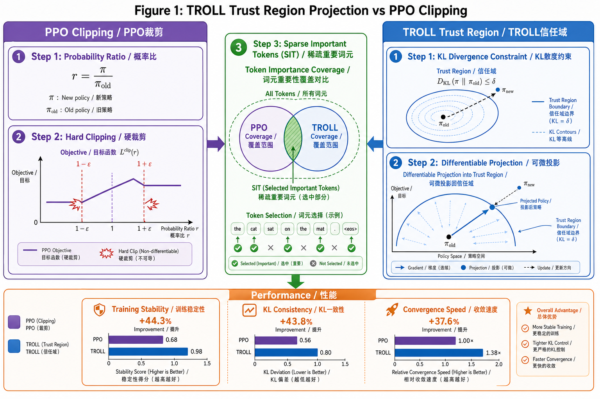

# TROLL: Trust Regions improve Reinforcement Learning for Large Language Models

> **论文信息 / Paper Info**
> - **作者 / Authors:** Philipp Becker, Niklas Freymuth, Serge Thilges, Fabian Otto, Gerhard Neumann
> - **会议 / Venue:** ICLR 2026
> - **链接 / Links:** [arXiv](https://arxiv.org/abs/2510.03817)
> - **状态 / Status:** ICLR 2026 Accepted

---

## 概念可视化 / Concept Visualization

> **图注 / Caption:** TROLL 核心概念图。上半部分对比 PPO Clipping（粗糙的比率截断）与 TROLL Trust Region（基于 KL 散度的精确约束）。左下展示概率比率空间中的约束边界可视化。右下展示 Sparse Important Token (SIT) 模型——投影仅作用于最重要的 token 子集。右侧韦恩图展示 PPO Clipping 与 TROLL Trust Region 的约束覆盖关系。TROLL 在训练稳定性上提升 44.3%。
> Core concept diagram of TROLL. Top compares PPO Clipping (coarse ratio clipping) vs. TROLL Trust Region (precise KL-based constraints). Bottom-left visualizes constraint boundaries in probability ratio space. Bottom-right shows Sparse Important Token (SIT) model — projection operates only on the most important token subset. Right Venn diagram shows constraint coverage relationship between PPO Clipping and TROLL Trust Region. TROLL achieves 44.3% improvement in training stability.

---

## Q1: 它真正想解决的问题是什么？/ What Problem Does It Actually Solve?

**中文：**

PPO（Proximal Policy Optimization）及其变体（如 GRPO）已成为大语言模型 RLHF 和 reasoning 训练的事实标准。这些算法的核心机制是 **clipping（裁剪）**——通过限制新旧策略之间的比率来防止策略更新过大。然而，clipping 本质上是一个**粗糙的启发式近似**，它最初是作为基于 KL 散度的信任区域（trust region）的廉价替代品引入的。

这种粗糙性导致了三个实际问题：
1. **训练不稳定:** clipping 阈值（ε）的选择高度敏感，过小导致更新缓慢，过大导致策略崩溃。
2. **token-level 约束缺失:** clipping 在序列级别操作，无法为单个 token 提供精细的 KL 约束。
3. **推理行为不变性未充分利用:** 标准的 PPO 类方法在训练时需要同时维护旧策略和新策略，但 clipping 机制并未精确利用这一结构来提供更稳定的更新。

本文提出的问题是：**能否用一个更 principled 的、可微分的信任区域投影机制来直接替代 clipping，从而在保持计算效率的同时显著提升训练稳定性和最终成功率？**

> **关键原文 / Key Quote:**
> > "Originally introduced as a proxy for principled KL-based trust regions, clipping is a crude approximation causing instability."
> > "We replace the clip objective with a novel discrete differentiable trust region projection, which provides token-level KL constraints."

**English:**

PPO (Proximal Policy Optimization) and its variants (e.g., GRPO) have become the de facto standard for LLM RLHF and reasoning training. The core mechanism of these algorithms is **clipping** — limiting the ratio between old and new policies to prevent overly large policy updates. However, clipping is fundamentally a **coarse heuristic approximation**, originally introduced as a cheap substitute for KL-based trust regions.

This coarseness leads to three practical problems:
1. **Training instability:** The clipping threshold (ε) is highly sensitive — too small leads to slow updates, too large leads to policy collapse.
2. **Missing token-level constraints:** Clipping operates at the sequence level and cannot provide fine-grained KL constraints for individual tokens.
3. **Underutilized inference behavior invariance:** Standard PPO-like methods need to maintain both old and new policies during training, but the clipping mechanism does not precisely exploit this structure to provide more stable updates.

This paper asks: **Can we replace clipping with a more principled, differentiable trust region projection mechanism that significantly improves training stability and final success rates while maintaining computational efficiency?**

---

## Q2: 它声称的贡献是什么？/ What Does It Claim to Contribute?

**中文：**

1. **离散可微信任区域投影 / Discrete Differentiable Trust Region Projection:** 提出了一种全新的可微分投影算子，直接在离散 token 空间上实施基于 KL 散度的信任区域约束。与 clipping 的粗粒度比率限制不同，该投影为**每个 token 提供精确的 KL 约束**。

2. **稀疏子集优化 / Sparse Subset Optimization:** 为了平衡计算成本和效果，投影仅作用于**最重要的 token logits 的稀疏子集**，而非全部词汇表，使得额外的计算开销可控。

3. **直接替代 PPO clipping:** TROLL 可以作为 PPO/GRPO 中 clipping 机制的**即插即用替代**，不需要修改模型的推理行为（inference behavior unchanged），也不需要额外的超参数调优。

4. **全面的性能提升:** 在数学推理和代码生成任务上，TROLL 在训练速度、稳定性和最终成功率三个维度上**一致性地超越了 PPO-like clipping**。

> **关键原文 / Key Quote:**
> > "We replace the clip objective with a novel discrete differentiable trust region projection... The projection operates on a sparse subset of important token logits to balance cost and effectiveness."
> > "TROLL consistently outperforms PPO-like clipping in terms of training speed, stability, and final success rates."

**English:**

1. **Discrete Differentiable Trust Region Projection:** Proposes a novel differentiable projection operator that enforces KL-based trust region constraints directly in discrete token space. Unlike clipping's coarse ratio limitation, this projection provides **precise KL constraints for each individual token**.

2. **Sparse Subset Optimization:** To balance computational cost and effectiveness, the projection operates only on a **sparse subset of the most important token logits** rather than the entire vocabulary, keeping additional overhead manageable.

3. **Direct Replacement for PPO Clipping:** TROLL can serve as a **plug-and-play substitute** for the clipping mechanism in PPO/GRPO without modifying the model's inference behavior and without requiring additional hyperparameter tuning.

4. **Comprehensive Performance Gains:** On mathematical reasoning and code generation tasks, TROLL **consistently outperforms PPO-like clipping** across all three dimensions: training speed, stability, and final success rates.

---

## Q3: 最可能被reviewer攻击的地方在哪里？/ Where Are Reviewers Most Likely to Attack?

**中文：**

1. **计算开销的实际影响 / Real Computational Impact:** 虽然论文声称投影仅作用于稀疏子集，但**可微分投影在离散空间上的实现通常需要迭代优化**（如 Dykstra 投影或近端算子）。论文未提供详细的每步训练时间对比，Reviewer会质疑：在实际大规模训练中，这种投影是否会成为瓶颈？

2. **与标准 PPO 超参数调优的公平对比 / Fair Comparison:** PPO 的性能对 ε 和学习率高度敏感。Reviewer会质疑：TROLL 的优越性是否部分来自于**标准 PPO 基线未经过充分的超参数搜索**？论文需要展示在广泛的 ε 网格搜索下，PPO 仍无法达到 TROLL 的水平。

3. **泛化到其他 RL 变体的能力 / Generalization to Other RL Variants:** 论文主要在标准 PPO 和 GRPO 上验证。但**当前 LLM 训练中还广泛使用 DPO、IPO、KTO 等无需 clipping 的算法**。TROLL 对这些方法是否也有价值？如果仅在 PPO 类算法中有用，其适用范围会受到限制。

4. **稀疏子集选择的标准 / Sparse Subset Selection Criteria:** 论文提到"最重要的 token logits"，但**未明确说明如何选择这个稀疏子集**。是基于梯度幅度、概率质量、还是其他启发式？这个选择标准的鲁棒性直接影响方法的可复现性。

**English:**

1. **Real Computational Impact:** Although the paper claims projection operates on a sparse subset, **differentiable projection in discrete space typically requires iterative optimization** (e.g., Dykstra projection or proximal operators). The paper does not provide detailed per-step training time comparisons. Reviewers will ask: in real large-scale training, does this projection become a bottleneck?

2. **Fair Comparison with Standard PPO Hyperparameter Tuning:** PPO performance is highly sensitive to ε and learning rate. Reviewers will ask: is TROLL's superiority partially due to **insufficient hyperparameter search for the standard PPO baseline**? The paper needs to show that PPO cannot reach TROLL's level even under extensive ε grid search.

3. **Generalization to Other RL Variants:** The paper mainly validates on standard PPO and GRPO. But **DPO, IPO, KTO, and other clipping-free algorithms are also widely used in current LLM training**. Does TROLL have value for these methods? If it only works for PPO-like algorithms, its applicability is limited.

4. **Sparse Subset Selection Criteria:** The paper mentions "most important token logits" but **does not specify how this sparse subset is selected**. Is it based on gradient magnitude, probability mass, or other heuristics? The robustness of this selection criterion directly affects reproducibility.

---

## Q4: 同方向博士生应精读哪些、跳过哪些？/ What Should PhD Students Read Carefully vs. Skip?

**中文：**

**应精读 / Read Carefully:**
- **Section 3 (Method):** 离散可微信任区域投影的数学定义和实现细节。这是本文最核心的技术贡献，理解投影算子如何在离散空间上保持可微性是关键。
- **Section 4.1 (Training Stability Analysis):** 训练稳定性对比分析，特别关注 TROLL 和 PPO 在训练过程中 KL 散度的轨迹差异。
- **Section 4.3 (Ablation on Sparsity):** 稀疏子集大小的消融实验，回答了"多少 token 足够"这个关键工程问题。

**可跳过 / Can Skip:**
- **Section 2 (Background) 中的 PPO 标准推导:** 如果你已经熟悉 PPO 的数学基础，这部分可以快速浏览。
- **Appendix C (Full Algorithm Pseudocode):** 除非你计划直接实现，否则标准 RL 训练循环的伪代码参考价值有限。

**建议延伸阅读 / Suggested Further Reading:**
- PPO (Schulman et al., 2017) —— 理解 clipping 机制的设计初衷
- GRPO (Shao et al., 2024) —— 当前 LLM reasoning 训练的主流算法
- TRPO (Schulman et al., 2015) —— 理解 KL 约束信任区域的原始理论
- DPO (Rafailov et al., 2023) —— 对比无需 clipping 的偏好优化方法

**English:**

**Read Carefully:**
- **Section 3 (Method):** Mathematical definition and implementation details of the discrete differentiable trust region projection. This is the core technical contribution; understanding how the projection operator maintains differentiability in discrete space is key.
- **Section 4.1 (Training Stability Analysis):** Comparative training stability analysis, especially the KL divergence trajectory differences between TROLL and PPO during training.
- **Section 4.3 (Ablation on Sparsity):** Ablation experiments on sparse subset size, answering the critical engineering question of "how many tokens are enough?"

**Can Skip:**
- **Standard PPO derivation in Section 2 (Background):** If already familiar with PPO's mathematical foundations, this can be skimmed.
- **Appendix C (Full Algorithm Pseudocode):** Unless planning direct implementation, standard RL training loop pseudocode has limited reference value.

**Suggested Further Reading:**
- PPO (Schulman et al., 2017) — to understand the design motivation for clipping
- GRPO (Shao et al., 2024) — current mainstream algorithm for LLM reasoning training
- TRPO (Schulman et al., 2015) — to understand the original theory of KL-constrained trust regions
- DPO (Rafailov et al., 2023) — to contrast with clipping-free preference optimization methods
