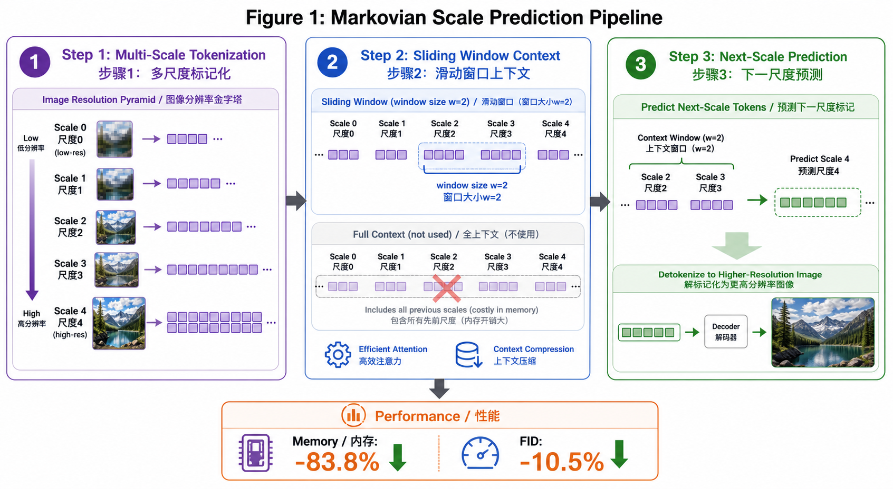

# Markovian Scale Prediction: A New Era of Visual Autoregressive Generation

> **论文信息 / Paper Info**
> - **作者 / Authors:** Yu Zhang, Jingyi Liu, Yiwei Shi, Qi Zhang, Duoqian Miao, Changwei Wang, Longbing Cao
> - **会议 / Venue:** CVPR 2026
> - **链接 / Links:** [arXiv](https://arxiv.org/abs/2511.23334) | [Open Access PDF](https://openaccess.thecvf.com/content/CVPR2026/papers/Zhang_Markovian_Scale_Prediction_A_New_Era_of_Visual_Autoregressive_Generation_CVPR_2026_paper.pdf)
> - **投稿日期 / Submitted:** 28 Nov 2025 | **修订日期 / Revised:** 3 Mar 2026

---

## 概念可视化 / Concept Visualization

> **图注 / Caption:** Markovian Scale Prediction 核心概念图。左侧展示 Full Context VAR 的全上下文依赖（所有先前尺度参与预测），右侧展示 Sliding Window MSP 的局部马尔可夫依赖（仅最近2个窗口）。中间为多尺度 Token 化流程（Scale 0→4），底部为性能对比：内存降低83.8%，FID提升10.5%。
> Concept diagram of Markovian Scale Prediction. Left shows Full Context VAR's full-context dependency (all prior scales participate in prediction), right shows Sliding Window MSP's local Markov dependency (only the 2 most recent windows). Center shows multi-scale tokenization flow (Scale 0→4), bottom shows performance comparison: 83.8% memory reduction, 10.5% FID improvement.

---

## Q1: 它真正想解决的问题是什么？/ What Problem Does It Actually Solve?

**中文：**

Visual AutoRegressive modeling (VAR) 通过"next-scale prediction"（下一尺度预测）重新激活了自回归视觉生成，取得了令人印象深刻的生成质量。然而，VAR存在一个根本性的效率瓶颈：**在预测第s个尺度时，模型需要依赖所有先前尺度的完整上下文（full-context dependency）**。当生成高分辨率图像（如1024×1024）时，这种全上下文依赖导致峰值内存消耗随尺度数量线性甚至超线性增长，严重限制了模型在高分辨率生成场景中的可扩展性。

本文的核心问题是：**能否在保持VAR生成质量的前提下，大幅降低其内存开销？** 作者观察到，在尺度序列中，远距离的早期尺度对当前尺度的影响可能可以通过局部马尔可夫假设来近似。

> **关键原文 / Key Quote:**
> > "Visual AutoRegressive modeling (VAR) based on next-scale prediction has revitalized autoregressive visual generation. Full-context dependency creates overhead."

**English:**

Visual AutoRegressive modeling (VAR) has reinvigorated autoregressive visual generation through "next-scale prediction," achieving impressive generation quality. However, VAR suffers from a fundamental efficiency bottleneck: **when predicting scale s, the model depends on full context from all previous scales**. When generating high-resolution images (e.g., 1024×1024), this full-context dependency causes peak memory consumption to grow linearly or even super-linearly with the number of scales, severely limiting scalability.

This paper asks: **Can we dramatically reduce VAR's memory overhead while preserving generation quality?** The authors observe that in scale sequences, the influence of distant early scales on the current scale may be approximable via a local Markov assumption.

---

## Q2: 它声称的贡献是什么？/ What Does It Claim to Contribute?

**中文：**

1. **Markovian Scale Prediction (MSP) 机制:** 提出用滑动窗口（sliding window）压缩先前尺度的上下文，只保留最近若干尺度的信息。将全上下文依赖转化为局部马尔可夫依赖。
2. **显著的内存降低:** 在1024分辨率下，峰值内存消耗降低 **83.8%**，使得高分辨率自回归视觉生成在消费级GPU上成为可能。
3. **生成质量保持甚至提升:** 在256分辨率下FID降低 **10.5%**，证明压缩上下文不仅没有损害质量，反而通过减少噪声干扰提升了生成效果。
4. **简单且通用:** 方法"extremely simple yet highly effective"，可以即插即用地应用到任何基于VAR架构的生成模型中。

> **关键原文 / Key Quote:**
> > "Markovian Scale Prediction... utilizes a partial Markov framework managing compressed context... decreases peak memory consumption by 83.8%... FID scores lowered 10.5 percent at 256-resolution."

**English:**

1. **Markovian Scale Prediction (MSP):** Proposes using a sliding window to compress context from previous scales, retaining only information from the most recent few scales. Transforms full-context dependency into local Markov dependency.
2. **Dramatic Memory Reduction:** At 1024 resolution, peak memory consumption drops by **83.8%**, making high-resolution autoregressive visual generation feasible on consumer GPUs.
3. **Preserved or Improved Quality:** FID decreases by **10.5%** at 256 resolution, showing that compressed context not only avoids quality degradation but actually improves generation by reducing noise interference.
4. **Simple and General:** The method is "extremely simple yet highly effective" and can be plugged into any VAR-based generation architecture.

---

## Q3: 最可能被reviewer攻击的地方在哪里？/ Where Are Reviewers Most Likely to Attack?

**中文：**

1. **信息损失的理论边界未明 / Unclear Theoretical Bounds on Information Loss:** 论文通过实验验证了马尔可夫近似的效果，但**缺乏严格的理论分析**来证明：在什么条件下，滑动窗口截断不会丢失对当前尺度生成至关重要的信息？Reviewer会要求至少提供一个基于互信息或条件熵的上界分析。

2. **长程依赖是否真的不重要？/ Is Long-Range Dependency Really Unimportant?:** 虽然作者在常见图像数据集上验证了效果，但对于**具有强全局结构约束的生成任务**（如精确对称的建筑图像、严格的排版布局），早期尺度的全局信息可能至关重要。论文未在这些hard case上进行充分测试。

3. **与标准自回归的理论等价性缺失 / Missing Theoretical Equivalence:** 标准的VAR可以被看作是一种特定的自回归过程。引入马尔可夫窗口后，**模型的概率建模能力是否仍然覆盖相同的分布族？** 论文没有讨论这种近似与精确VAR之间的分布差距。

4. **对比基线不够全面 / Incomplete Baselines:** 论文主要与原始VAR对比，但未与同期其他VAR加速工作（如windowed attention、hierarchical caching等）进行充分对比。Reviewer会质疑：内存降低是马尔可夫假设的功劳，还是仅仅是任何窗口机制的通用效果？

**English:**

1. **Unclear Theoretical Bounds on Information Loss:** The paper validates the Markov approximation experimentally but **lacks rigorous theoretical analysis** proving under what conditions sliding-window truncation does not discard information critical for generating the current scale. Reviewers will demand at least an upper-bound analysis based on mutual information or conditional entropy.

2. **Is Long-Range Dependency Really Unimportant?:** Although validated on standard image datasets, for **generation tasks with strong global structural constraints** (e.g., precisely symmetric architectural images, strict typographic layouts), global information from early scales may be critical. The paper does not thoroughly test these hard cases.

3. **Missing Theoretical Equivalence:** Standard VAR can be viewed as a specific autoregressive process. After introducing the Markov window, **does the model's probability modeling capacity still cover the same family of distributions?** The paper does not discuss the distributional gap between this approximation and exact VAR.

4. **Incomplete Baselines:** The paper mainly compares against original VAR but does not sufficiently compare with contemporary VAR acceleration work (e.g., windowed attention, hierarchical caching). Reviewers will ask: is the memory reduction due to the Markov assumption specifically, or merely a generic effect of any windowing mechanism?

---

## Q4: 同方向博士生应精读哪些、跳过哪些？/ What Should PhD Students Read Carefully vs. Skip?

**中文：**

**应精读 / Read Carefully:**
- **Section 3 (Method):** Markovian Scale Prediction的核心实现细节——滑动窗口如何设计、上下文压缩的具体操作、与VAR原始架构的对比。这部分是本文的精华，也是最容易被复现和扩展的部分。
- **Section 4.2 (Memory Analysis):** 详细的内存 profiling 分析，展示了在不同分辨率下内存降低的具体来源。对于做系统方向的博士生尤其有价值。
- **Section 4.4 (Ablation on Window Size):** 窗口大小对生成质量和内存的影响消融实验，直接回答了"多大窗口够用"这个工程问题。

**可跳过 / Can Skip:**
- **Section 2 (Related Work) 的大部分内容:** VAR的背景介绍在已有文献中已有充分论述，除非你是刚进入该方向的新生。
- **Appendix中的训练超参数表:** 除非你要直接复现，否则标准训练配置参考价值有限。

**建议延伸阅读 / Suggested Further Reading:**
- VAR (Tian et al., 2024) —— 理解本文的baseline架构
- Diffusion Models with DiT (Peebles & Xie, 2023) —— 对比自回归与扩散在高分辨率生成上的优劣
- RAPID-VAR / FastVAR (如有后续加速工作) —— 关注VAR加速方向的最新进展

**English:**

**Read Carefully:**
- **Section 3 (Method):** Core implementation details of Markovian Scale Prediction — how the sliding window is designed, the specific operations for context compression, and the comparison with the original VAR architecture. This is the essence of the paper and the most readily reproducible and extensible part.
- **Section 4.2 (Memory Analysis):** Detailed memory profiling analysis showing the specific sources of memory reduction at different resolutions. Especially valuable for systems-oriented PhD students.
- **Section 4.4 (Ablation on Window Size):** Ablation experiments on how window size affects generation quality and memory, directly answering the engineering question of "how large a window is enough?"

**Can Skip:**
- **Most of Section 2 (Related Work):** Background on VAR has been adequately covered in existing literature unless you are new to the direction.
- **Training hyperparameter tables in Appendix:** Unless you plan to directly reproduce, standard training configurations have limited reference value.

**Suggested Further Reading:**
- VAR (Tian et al., 2024) — to understand the baseline architecture
- Diffusion Models with DiT (Peebles & Xie, 2023) — to compare autoregressive vs. diffusion for high-resolution generation
- RAPID-VAR / FastVAR (if follow-up acceleration work exists) — to track the latest progress in VAR acceleration
