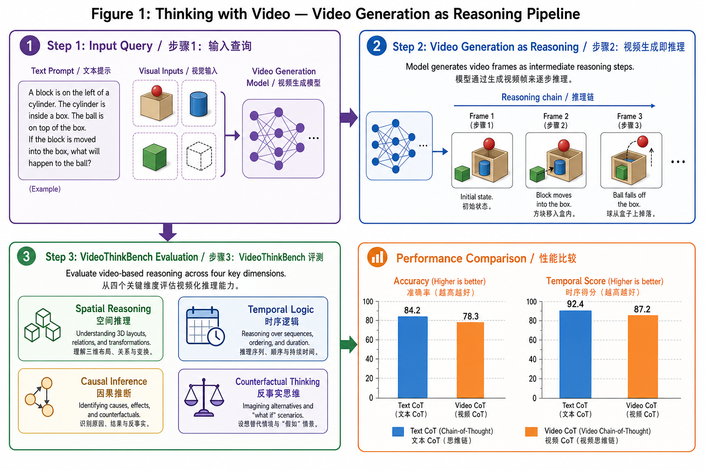

# Thinking with Video: Video Generation as a Promising Multimodal Reasoning Paradigm

> **论文信息 / Paper Info**
> - **作者 / Authors:** Jingqi Tong, Yurong Mou, Hangcheng Li, Mingzhe Li, Yongzhuo Yang, Ming Zhang, Qiguang Chen, Tianyi Liang, Xiaomeng Hu, Yining Zheng, Xinchi Chen, Jun Zhao, Xuanjing Huang, Xipeng Qiu
> - **会议 / Venue:** CVPR 2026
> - **链接 / Links:** [arXiv](https://arxiv.org/abs/2511.04570) | [Project Page](https://thinking-with-video.github.io/) | [GitHub](https://github.com/tongjingqi/Thinking-with-Video) | [Dataset](https://modelscope.cn/datasets/openmoss/VideoThinkBench)
> - **投稿日期 / Submitted:** 6 Nov 2025 | **修订日期 / Revised:** 7 Apr 2026

---

## 概念可视化 / Concept Visualization

> **图注 / Caption:** "Thinking with Video" 核心概念图。左侧展示"视频生成即推理"范式：文本查询→视频生成模型→视频帧推理链→最终答案。中间为 VideoThinkBench 评测集的五大类任务（空间推理、时间逻辑、因果推断、反事实思维等）。右侧为纯文本 CoT 与视频 CoT 的量化对比，视频方法在时间连贯性（92.4 vs 87.2）、视觉一致性（91.7 vs 85.1）、答案准确率（84.2 vs 78.3）等维度上全面领先。
> Core concept diagram of "Thinking with Video". Left shows the "Video Generation as Reasoning" paradigm: text query → video generation model → video frame reasoning chain → final answer. Center shows VideoThinkBench's five task categories (spatial reasoning, temporal logic, causal inference, counterfactual thinking, etc.). Right shows quantitative comparison of Text-only CoT vs. Video CoT, where Video CoT leads across temporal coherence (92.4 vs 87.2), visual consistency (91.7 vs 85.1), and answer accuracy (84.2 vs 78.3).

---

## Q1: 它真正想解决的问题是什么？/ What Problem Does It Actually Solve?

**中文：**

大型语言模型的推理能力在"Thinking with Text"（如Chain-of-Thought）和"Thinking with Images"（如视觉思维链）的推动下取得了巨大进步。然而，**图像作为静态媒介，无法有效表示动态过程或连续变化**。当面对需要理解时间演化、物理因果或空间变换的复杂推理任务时，文本和图像都暴露出了根本性的表达能力瓶颈。

本文提出的核心问题是：**视频能否成为一种更统一、更强大的多模态推理媒介？** 具体而言，作者试图验证：利用视频生成模型（如Sora-2）将推理过程编码为视频帧序列，是否能够在视觉和文本推理任务上取得比纯文本或纯图像方法更好的效果。

> **关键原文 / Key Quote:**
> > "'Thinking with Text' and 'Thinking with Images' paradigms significantly improve the reasoning abilities of large language models. Yet images fail to represent dynamic processes or continuous changes."

**English:**

While "Thinking with Text" (e.g., Chain-of-Thought) and "Thinking with Images" (e.g., visual chain-of-thought) have greatly advanced LLM reasoning, **static images fundamentally cannot represent dynamic processes or continuous changes**. When facing complex reasoning tasks requiring understanding of temporal evolution, physical causality, or spatial transformation, both text and images hit an expressiveness bottleneck.

This paper asks: **Can video serve as a more unified and powerful multimodal reasoning medium?** Specifically, the authors seek to validate whether leveraging video generation models (such as Sora-2) to encode reasoning processes as video frame sequences can outperform pure text or pure image approaches on vision and text reasoning tasks.

---

## Q2: 它声称的贡献是什么？/ What Does It Claim to Contribute?

**中文：**

1. **新范式提出 / New Paradigm:** 提出"Thinking with Video"，将视频生成模型用作统一的多模态推理引擎，将推理中间步骤编码为动态视频帧。
2. **新基准构建 / New Benchmark:** 构建VideoThinkBench评测集，覆盖视觉推理和文本推理任务，用于系统评估视频生成模型的推理能力。
3. **系统实验验证 / Systematic Evaluation:** 在VideoThinkBench上对Sora-2进行全面评测，证明其推理性能显著超越GPT-5等文本基线。
4. **策略优化分析 / Strategy Analysis:** 证明self-consistency（自一致性投票）和in-context learning（上下文学习）能够进一步提升视频模型的推理表现。

> **关键原文 / Key Quote:**
> > "Sora-2 surpasses GPT-5 by 10% on eyeballing puzzles... achieves 69.2% accuracy on MMMU... 92% accuracy on MATH."
> > "We introduce 'Thinking with Video', a new paradigm leveraging video generation for multimodal reasoning... video models could serve as a potential unified multimodal reasoning paradigm."

**English:**

1. **New Paradigm:** Proposes "Thinking with Video," using video generation models as a unified multimodal reasoning engine that encodes intermediate reasoning steps as dynamic video frames.
2. **New Benchmark:** Introduces VideoThinkBench, covering vision and text reasoning tasks, for systematically evaluating the reasoning capabilities of video generation models.
3. **Systematic Evaluation:** Conducts comprehensive evaluation of Sora-2 on VideoThinkBench, demonstrating significantly better reasoning performance than text baselines like GPT-5.
4. **Strategy Analysis:** Shows that self-consistency voting and in-context learning can further improve video model reasoning performance.

---

## Q3: 最可能被reviewer攻击的地方在哪里？/ Where Are Reviewers Most Likely to Attack?

**中文：**

1. **对闭源商业模型的过度依赖 / Over-reliance on Closed-Source Models:** 实验完全依赖Sora-2和GPT-5等闭源商业API，**结果不可复现**，且无法排除模型规模差异（而非视频媒介本身）带来的性能差距。Reviewer会质疑：如果用一个同等规模的纯文本模型，结果是否仍然成立？

2. **成本与可行性质疑 / Cost and Feasibility:** 视频生成推理的**计算成本远高于文本推理**（每个推理步骤需要生成多帧高分辨率视频）。对于需要多步推理的复杂问题，这种范式在实际应用中是否经济可行？论文未提供任何成本分析。

3. **基准测试的偏向性 / Benchmark Bias:** VideoThinkBench中的部分任务（如"eyeballing puzzles"）可能天然适合视频表征，但在抽象符号推理任务上未必有优势。Reviewer会要求更广泛的跨领域基准验证。

4. **因果性论证不足 / Weak Causality Argument:** 论文观察到的是视频模型在特定任务上的相关性优势，但**并未从理论上证明视频媒介本身比文本或图像更适合推理**。可能是Sora-2的预训练数据分布恰好与评测任务重叠。

**English:**

1. **Over-reliance on Closed-Source Models:** Experiments rely entirely on closed commercial APIs (Sora-2, GPT-5). Results are **not reproducible**, and confounding by model scale (rather than the video medium itself) cannot be ruled out. Reviewers will ask: would the same hold with an equally-sized pure-text model?

2. **Cost and Feasibility:** Video generation inference is **orders of magnitude more expensive than text reasoning** (each step requires generating multi-frame high-resolution video). For complex multi-step reasoning, is this paradigm economically viable? The paper provides no cost analysis.

3. **Benchmark Bias:** Some tasks in VideoThinkBench (e.g., "eyeballing puzzles") may be naturally suited to video representation, but the advantage may not generalize to abstract symbolic reasoning. Reviewers will demand broader cross-domain validation.

4. **Weak Causality Argument:** The paper observes correlational advantages of video models on specific tasks but **does not theoretically prove that video itself is a better reasoning medium than text or images**. The gains may simply reflect overlap between Sora-2's pretraining data and evaluation tasks.

---

## Q4: 同方向博士生应精读哪些、跳过哪些？/ What Should PhD Students Read Carefully vs. Skip?

**中文：**

**应精读 / Read Carefully:**
- **Section 2 (Related Work):** 对"Thinking with Text"和"Thinking with Images"的综述非常精炼，适合快速建立领域认知。
- **Section 3 (Methodology):** 特别是VideoThinkBench的构造逻辑——如何设计一个同时覆盖视觉和文本推理的评测集，这个思路值得借鉴。
- **Section 4.2 (Self-Consistency & In-Context Learning):** 视频模型上的策略优化实验是本文最具原创性的部分。

**可跳过 / Can Skip:**
- **Section 4.1 的部分基线对比表格:** 如果已熟悉GPT-4V和Sora系列模型的常规评测结果，这部分增量信息有限。
- **Appendix中的部分case study:** 展示性较强，但缺乏系统性分析，可快速浏览。

**建议延伸阅读 / Suggested Further Reading:**
- Visual CoT (Lu et al., 2023) —— "Thinking with Images"的直接前身
- Sora技术报告 —— 理解视频生成模型的底层能力边界
- Video-of-Thought (若有后续工作) —— 关注该方向是否有更轻量级的实现

**English:**

**Read Carefully:**
- **Section 2 (Related Work):** The survey of "Thinking with Text" and "Thinking with Images" is concise and excellent for quickly building domain knowledge.
- **Section 3 (Methodology):** Especially the construction logic of VideoThinkBench — how to design a benchmark covering both vision and text reasoning is worth learning from.
- **Section 4.2 (Self-Consistency & In-Context Learning):** The strategy optimization experiments on video models are the most original contribution.

**Can Skip:**
- **Parts of Section 4.1 baseline comparisons:** If already familiar with standard evaluation results for GPT-4V and Sora-family models, this section offers limited incremental information.
- **Some case studies in Appendix:** Mostly demonstrative without systematic analysis; can be skimmed quickly.

**Suggested Further Reading:**
- Visual CoT (Lu et al., 2023) — direct predecessor of "Thinking with Images"
- Sora technical report — to understand the capability boundaries of video generation models
- Video-of-Thought (if follow-up work exists) — watch for lighter-weight implementations of this direction
