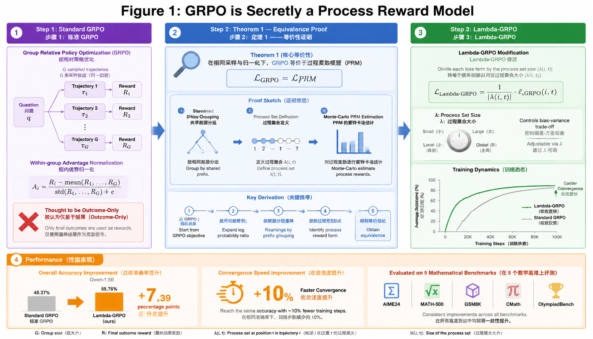

# GRPO is Secretly a Process Reward Model

> **论文信息 / Paper Info**
> - **作者 / Authors:** Michael Sullivan, Alexander Koller
> - **会议 / Venue:** ICML 2026
> - **链接 / Links:** [arXiv](https://arxiv.org/abs/2509.21154) | [OpenReview](https://openreview.net/forum?id=o0k034W6vx)
> - **投稿日期 / Submitted:** Sep 2025 | **状态 / Status:** ICML 2026 Accepted

---

## 概念可视化 / Concept Visualization

> **图注 / Caption:** "GRPO is Secretly a PRM" 核心概念图。左侧展示标准 GRPO：组内归一化的 advantage 计算 A = R − mean(R)/std(R)，此前被认为仅利用结果级奖励。中间为定理1等价性证明：L_GRPO = L_PRM，展示 GRPO 的组归一化如何隐式实现蒙特卡洛 PRM 估计。右侧为 λ-GRPO 改进：引入可调参数 λ 控制奖励塑形，Qwen-1.5B 准确率从 48.37% 提升至 55.76%。底部展示训练动态曲线：GRPO 损失收敛至 PRM-aware 目标的过程。
> Core concept diagram of "GRPO is Secretly a PRM". Left shows Standard GRPO: within-group normalized advantage computation A = R − mean(R)/std(R), previously thought to only utilize outcome-level rewards. Center shows Theorem 1 equivalence proof: L_GRPO = L_PRM, demonstrating how GRPO's group normalization implicitly implements Monte-Carlo PRM estimation. Right shows λ-GRPO improvement: tunable λ parameter for reward shaping, Qwen-1.5B accuracy improves from 48.37% to 55.76%. Bottom shows training dynamics: GRPO loss converging toward the PRM-aware objective.

---

## Q1: 它真正想解决的问题是什么？/ What Problem Does It Actually Solve?

**中文：**

Group Relative Policy Optimization (GRPO) 已成为当前大语言模型推理能力后训练（post-training）的主流算法之一，被广泛应用于 DeepSeek-R1、Qwen 等模型的 reasoning 训练中。然而，GRPO 的设计初衷是一个仅依赖 outcome reward（结果奖励）的算法，它通过对同一问题采样的一组回答进行组内归一化来估计 advantage，从而避免了训练一个显式的 Reward Model。

但社区中一直存在一个悬而未决的问题：**GRPO 这种看似"无过程监督"的算法，是否真的完全忽略了中间推理步骤的质量？** 如果中间步骤的质量确实会影响训练动态，那么 GRPO 的内在机制是什么？它是否在以一种隐式的方式实现了 Process Reward Model (PRM) 的功能？

此外，GRPO 在实际应用中被观察到存在**步骤频率不平衡**的问题——某些推理步骤在采样中出现的频率远高于其他步骤，导致这些高频步骤对 loss 的贡献被过度放大，而低频步骤则被淹没。

> **关键原文 / Key Quote:**
> > "GRPO is in fact equivalent to a process-reward-sensitive RL objective equipped with a Monte-Carlo-based PRM."

**English:**

Group Relative Policy Optimization (GRPO) has become one of the dominant algorithms for post-training reasoning capabilities in large language models, widely used in the training of DeepSeek-R1, Qwen, and other models. GRPO was originally designed as an algorithm relying solely on outcome rewards, estimating advantages through within-group normalization of sampled responses for the same question, thereby avoiding the need to train an explicit Reward Model.

However, a lingering question in the community has been: **Does this seemingly "process-supervision-free" algorithm truly ignore the quality of intermediate reasoning steps?** If intermediate step quality does affect training dynamics, what is GRPO's intrinsic mechanism? Is it implicitly implementing Process Reward Model (PRM) functionality?

Additionally, GRPO has been observed in practice to suffer from **imbalanced step frequencies** — certain reasoning steps appear far more frequently in sampling than others, causing these high-frequency steps to be over-represented in the loss while low-frequency steps are drowned out.

---

## Q2: 它声称的贡献是什么？/ What Does It Claim to Contribute?

**中文：**

1. **理论揭示：GRPO = 隐式PRM / Theoretical Revelation:** 严格证明了标准 GRPO 的 loss 函数 **L_GRPO 等价于一个配备了蒙特卡洛估计 PRM 的 process-reward-sensitive RL 目标函数 L_PRM**。这意味着 GRPO 并非"无过程监督"，而是以隐式、非平凡的方式在利用过程级信号。

2. **缺陷诊断：步骤频率不平衡 / Defect Diagnosis:** 由于 GRPO 的 advantage 计算基于共享前缀（shared prefixes）的 rollout 分组，**高频步骤所在的 process set 规模更大，导致其对 loss 的梯度贡献被不成比例地放大**。这破坏了 exploration-exploitation 的平衡。

3. **λ-GRPO 改进算法 / λ-GRPO:** 提出一种极简修改——将 loss 中的每一项除以其所属 process set 的大小 |λ(i,t)|，使得每个 process set 对 loss 的影响按索引均等化。即：
   > L_λ-GRPO(G) = Σ Σ [P_i,t · a_i − D_i,t] / |λ(i,t)|

4. **实验验证 / Experimental Validation:** 在 AIME24、MATH-500 等五个推理基准上，λ-GRPO 训练的 Qwen-1.5B 模型平均准确率从标准 GRPO 的 0.4837 提升至 0.5576，且验证准确率峰值提前 10% 的步数到达，训练成本几乎无增加。

**English:**

1. **Theoretical Revelation: GRPO = Implicit PRM:** Rigorously proves that the standard GRPO loss function **L_GRPO is equivalent to a process-reward-sensitive RL objective L_PRM equipped with a Monte-Carlo-estimated PRM**. This means GRPO is not "process-supervision-free" but rather utilizes process-level signals in an implicit, non-trivial way.

2. **Defect Diagnosis: Step Frequency Imbalance:** Because GRPO's advantage computation groups rollouts by shared prefixes, **high-frequency steps belong to larger process sets, causing their gradient contributions to be disproportionately amplified**. This disrupts the exploration-exploitation balance.

3. **λ-GRPO Improvement:** Proposes a minimal modification — dividing each term in the loss by the size of its process set |λ(i,t)|, so that each process set affects the loss equally per index:
   > L_λ-GRPO(G) = Σ Σ [P_i,t · a_i − D_i,t] / |λ(i,t)|

4. **Experimental Validation:** On five reasoning benchmarks (AIME24, MATH-500, etc.), λ-GRPO-trained Qwen-1.5B achieves average accuracy 0.5576 vs. 0.4837 for standard GRPO, with peak validation accuracy reached 10% earlier in training steps at negligible extra cost.

---

## Q3: 最可能被reviewer攻击的地方在哪里？/ Where Are Reviewers Most Likely to Attack?

**中文：**

1. **等价性证明的适用范围 / Scope of Equivalence Proof:** 论文证明的是标准 GRPO（使用 outcome reward、组内归一化）与蒙特卡洛 PRM 的等价性。但**如果 GRPO 使用了其他变体**（如加入 KL 散度约束、使用不同的 baseline 估计器、或采用 step-level clipping），等价性是否仍然成立？论文对此讨论不足。

2. **λ-GRPO 的鲁棒性 / Robustness of λ-GRPO:** 除以 |λ(i,t)| 虽然理论上解决了频率不平衡，但在**极端稀疏步骤**（|λ(i,t)| 很小甚至为1）的情况下，梯度会被过度放大，可能导致训练不稳定。论文未报告这类边界情况的行为。

3. **与显式 PRM 的成本对比不够完整 / Incomplete Cost Comparison with Explicit PRM:** 论文声称 λ-GRPO "reduces reliance on costly, explicit PRM annotation"，但未与任何实际的显式 PRM 方法（如 Math-Shepherd、RLHFlow 等）进行**头对头的训练成本与性能对比**。Reviewer会要求补充此类实验。

4. **实验规模的局限 / Limited Experimental Scale:** 论文主要在 1.5B 规模的模型上验证，对于**更大规模（如 7B、30B+）模型**，λ-GRPO 的优势是否仍然保持？高频步骤问题在大模型上可能因采样多样性增加而自然缓解。

**English:**

1. **Scope of Equivalence Proof:** The paper proves equivalence between standard GRPO (using outcome reward, within-group normalization) and a Monte-Carlo PRM. But **if GRPO uses other variants** (e.g., KL divergence constraints, different baseline estimators, or step-level clipping), does equivalence still hold? The paper lacks discussion on this.

2. **Robustness of λ-GRPO:** While dividing by |λ(i,t)| theoretically solves frequency imbalance, for **extremely sparse steps** (where |λ(i,t)| is very small or even 1), gradients would be overly amplified, potentially causing training instability. The paper does not report behavior in these boundary cases.

3. **Incomplete Cost Comparison with Explicit PRM:** The paper claims λ-GRPO "reduces reliance on costly, explicit PRM annotation" but does not perform a **head-to-head training cost and performance comparison** with any actual explicit PRM method (e.g., Math-Shepherd, RLHFlow, etc.). Reviewers will demand such experiments.

4. **Limited Experimental Scale:** The paper validates mainly on 1.5B-scale models. For **larger scales (e.g., 7B, 30B+)**, does λ-GRPO's advantage persist? The high-frequency step problem may be naturally mitigated in larger models due to increased sampling diversity.

---

## Q4: 同方向博士生应精读哪些、跳过哪些？/ What Should PhD Students Read Carefully vs. Skip?

**中文：**

**应精读 / Read Carefully:**
- **Section 3 (The Hidden PRM in GRPO):** 等价性证明的核心推导。这是本文的理论精华，也是最具持久价值的部分。建议手推一遍 Theorem 1 的证明，理解 shared prefix 如何定义 process set，以及为什么组内归一化恰好等价于蒙特卡洛 PRM 估计。
- **Section 4 (λ-GRPO):** 改进算法的具体实现细节。虽然只有一行修改，但理解 "为什么除 |λ(i,t)|" 比 "怎么改" 更重要。
- **Section 5.2 (Ablation on β):** 超参数 β 的消融实验，展示了 λ-GRPO 对 baseline 系数的敏感度。

**可跳过 / Can Skip:**
- **Section 2 (Background):** 如果你已经熟悉 PPO、GRPO 和 PRM 的基础知识，这部分可以快速浏览。
- **Appendix D (Full Proof Details):** 除非你要基于此做理论扩展，否则主文的证明已足够清晰。

**建议延伸阅读 / Suggested Further Reading:**
- DeepSeek-R1 技术报告 —— 理解 GRPO 在工业级 reasoning 模型中的实际应用
- Math-Shepherd (Wang et al., 2024) —— 显式 PRM 的经典工作，可与本文隐式 PRM 对比
- ReMax (Li et al., 2024) —— 另一个 outcome-reward-only 的 RL 算法，可思考是否也存在隐式 PRM 结构
- DAPO (Yu et al., 2025) —— 关注 GRPO 的后续改进方向

**English:**

**Read Carefully:**
- **Section 3 (The Hidden PRM in GRPO):** The core derivation of the equivalence proof. This is the theoretical essence and most enduringly valuable part of the paper. I recommend hand-deriving Theorem 1 to understand how shared prefixes define process sets and why within-group normalization happens to be equivalent to Monte-Carlo PRM estimation.
- **Section 4 (λ-GRPO):** Specific implementation details of the improved algorithm. Although it's only a one-line modification, understanding "why divide by |λ(i,t)|" is more important than "how to modify."
- **Section 5.2 (Ablation on β):** Ablation experiments on hyperparameter β, showing λ-GRPO's sensitivity to the baseline coefficient.

**Can Skip:**
- **Section 2 (Background):** If already familiar with PPO, GRPO, and PRM basics, this section can be skimmed.
- **Appendix D (Full Proof Details):** Unless planning theoretical extensions based on this, the main-text proof is clear enough.

**Suggested Further Reading:**
- DeepSeek-R1 technical report — to understand GRPO's practical application in industrial-scale reasoning models
- Math-Shepherd (Wang et al., 2024) — classic explicit PRM work, contrast with this paper's implicit PRM
- ReMax (Li et al., 2024) — another outcome-reward-only RL algorithm; consider whether it also has an implicit PRM structure
- DAPO (Yu et al., 2025) — follow-up GRPO improvement directions
