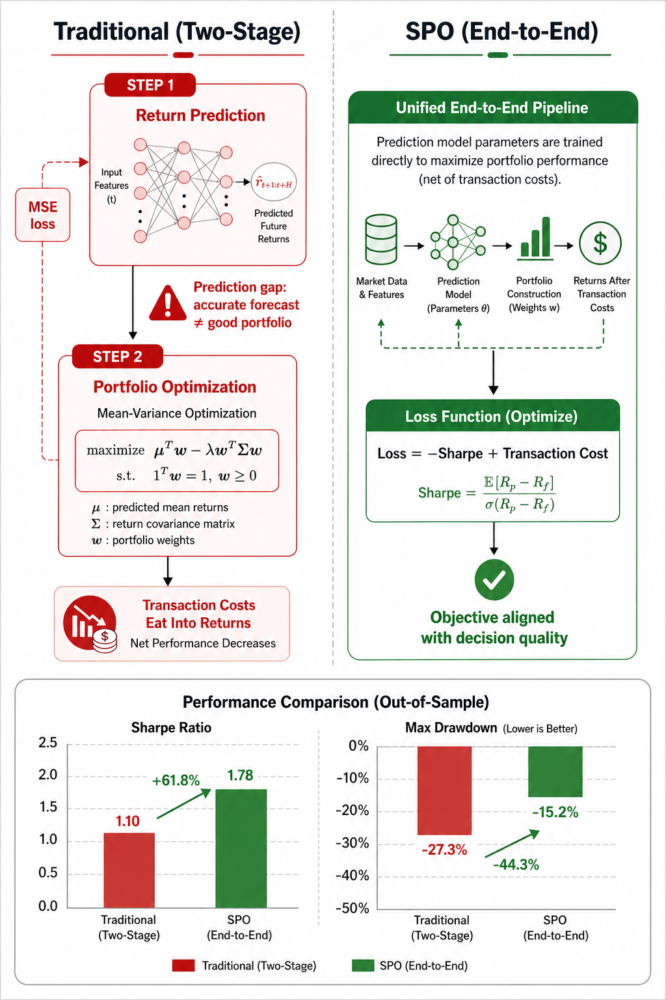

# Smart Predict-then-Optimize (SPO) for Portfolio Optimization

- **arXiv**: [2601.04062](https://arxiv.org/abs/2601.04062)
- **日期**: 2026-01-09
- **子领域**: 组合优化

> 深度解读: [explanation_spo_portfolio.md](../explanation_spo_portfolio.md) — 用"GPS导航"类比解读端到端组合优化

## 核心问题
传统量化投资是两阶段: 先预测收益 → 再优化组合。但预测准确的模型未必产生好的组合决策（尤其在存在交易成本、换手约束等市场摩擦时）。

## 方法
**Smart Predict-then-Optimize (SPO)**:
- 将学习目标直接对齐到组合决策质量
- 损失函数 = 组合表现 (Sharpe) + 交易成本
- 端到端训练: 预测参数直接影响组合权重

测试: 美国 ETF 数据 (2015-2025), 月度调仓, 含 2020 疫情压力测试

## 关键结果
- SPO 在风险调整收益上持续优于传统 MSE 两阶段方法
- 在 2020 疫情期间表现更稳健
- 换手率和交易成本更低

## 代码复现
→ [code/portfolio_optimization/spo_portfolio.py](../code/portfolio_optimization/spo_portfolio.py)

## 量化应用启示
- 端到端优化在有市场摩擦的真实场景中更有价值
- 不要只优化预测准确率, 要优化最终的决策质量
- 适合有交易成本约束的实际策略
