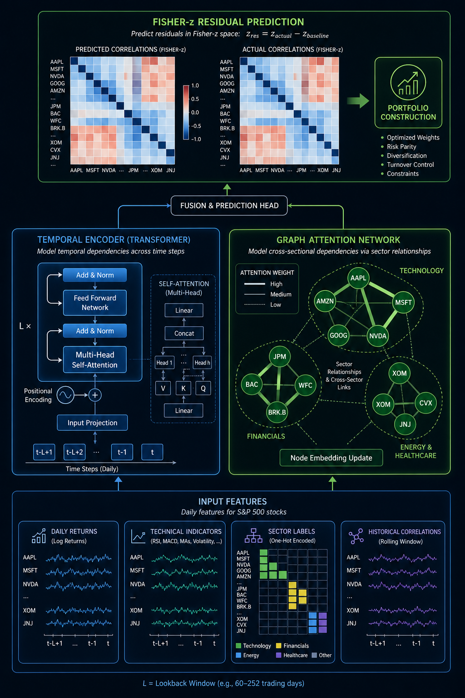

# Hybrid Transformer GNN for Equity Correlation Forecasting

- **arXiv**: [2601.04602](https://arxiv.org/abs/2601.04602)
- **日期**: 2026-01-08
- **子领域**: 时序预测 / 相关性预测

> 深度解读: [explanation_hybrid_transformer_gnn.md](../explanation_hybrid_transformer_gnn.md) — 用"天气预测"类比解读 Transformer+GNN 相关性预测

## 核心问题
股票间相关性是动态的、非平稳的。传统滚动窗口估计滞后严重，在市场压力时期尤其不可靠。

## 方法
**Temporal-Heterogeneous GNN (THGNN)**:

1. **Temporal Encoder** (Transformer): 学习时序非平稳性
2. **Graph Attention Network**: 利用行业/资产间结构做消息传递
3. **Fisher-z 残差预测**: 在 Fisher-z 空间预测相关性残差

特征: 日收益、技术指标、行业结构、历史相关性、宏观信号

## 关键结果
- S&P 500 成分股 10 日前瞻相关性预测
- 显著优于滚动窗口基线
- 改善转化为组合构建收益

## 代码复现
→ [code/time_series/correlation_gnn.py](../code/time_series/correlation_gnn.py)

## 量化应用启示
- 前瞻性相关性预测可优化组合构建和对冲策略
- GNN 适合建模资产间关系网络
- Fisher-z 变换使相关性预测更稳定
