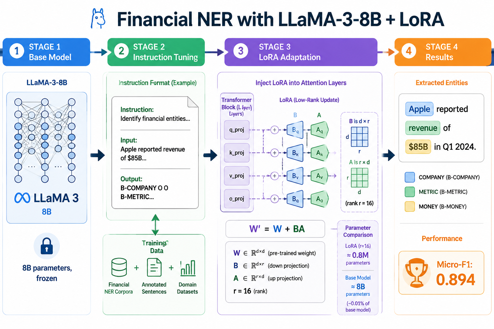

# Financial NER with LLaMA-3-8B + LoRA

- **arXiv**: [2601.10043](https://arxiv.org/abs/2601.10043)
- **日期**: 2026-01-11
- **子领域**: NLP / 金融文本

> 深度解读: [explanation_financial_ner.md](../explanation_financial_ner.md) — 用"新员工入职培训"类比解读 Instruction Tuning + LoRA

## 核心问题
金融文本中的命名实体识别 (NER) 对量化研究至关重要, 但通用 LLM 在金融实体上经常出错。

## 方法
- 基础模型: LLaMA-3-8B (Meta)
- 适配方法: Instruction Fine-tuning + LoRA
- LoRA 配置: rank=16, target=q/k/v/o projections
- 只更新 ~0.05% 参数

## 数据
- 1,693 句金融文本
- 8 种实体类型: COMPANY, PERSON, PRODUCT, METRIC, LOCATION, DATE, MONEY, PERCENT

## 结果
- **Micro-F1: 0.894**
- 比从头训练 BERT 级别模型更高效

## 代码复现
→ [code/nlp_finance/financial_ner.py](../code/nlp_finance/financial_ner.py)

## 量化应用
- 从研报中自动提取: 公司/指标/数字
- 构建事件驱动策略: 识别关键人物言论
- 与知识图谱结合做关联分析
