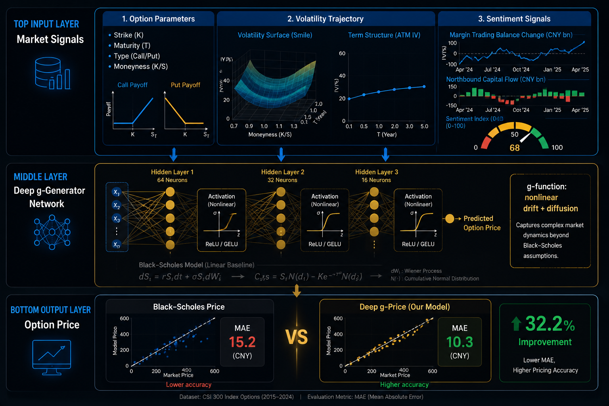

# Deep g-Pricing for CSI 300 Index Options

- **arXiv**: [2601.18804](https://arxiv.org/abs/2601.18804)
- **日期**: 2026-01-15
- **子领域**: 衍生品定价

> 深度解读: [explanation_deep_g_pricing.md](../explanation_deep_g_pricing.md) — 用"天气预报"类比解读深度学习期权定价

## 核心问题
Black-Scholes 假设 (常数波动率、对数正态分布) 在真实市场中失效, 尤其在中国 A 股期权市场。

## 方法
**Deep g-Pricing**:
- 非线性 g-生成器模型替代 BS 假设
- 融合: 波动率轨迹 + 市场情绪信号
  - 融资融券余额变化
  - 北向资金流向
  - 情绪指数
- 数据: CSI 300 指数期权

## 关键结果
- MAE 降低 32.2% (vs BS)
- **Call 期权**: 定价改善主要由情绪驱动
- **Put 期权**: 波动路径和情绪共同驱动

## 代码复现
→ [code/portfolio_optimization/deep_option_pricing.py](../code/portfolio_optimization/deep_option_pricing.py)

## 量化启示
- 情绪指标对期权定价有实质帮助
- 中国市场的特殊性: 散户情绪影响更大
- 可用于期权做市和对冲策略
