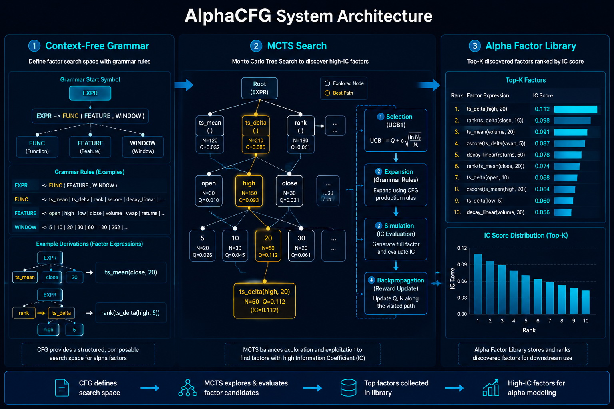

# AlphaCFG: Alpha Discovery via Grammar-Guided Learning and Search

- **arXiv**: [2601.22119](https://arxiv.org/abs/2601.22119)
- **日期**: 2026-01-15
- **子领域**: 因子挖掘 / Alpha Factor

> 深度解读: [explanation_alphacfg.md](../explanation_alphacfg.md) — 用"乐高积木"类比解读 CFG+MCTS 因子搜索

## 核心问题
自动发现公式化 alpha 因子是量化投资的核心问题。传统方法（遗传编程、随机搜索）缺乏对因子语法的结构约束，产生大量无效或冗余表达式。

## 方法
**AlphaCFG** — 基于上下文无关文法 (CFG) 的 alpha 因子发现框架：

1. **文法定义**: 用 CFG 定义合法 alpha 因子的语法空间
   - 时序函数: `ts_mean`, `ts_rank`, `ts_corr`, `ts_delta` 等
   - 截面函数: `rank`, `zscore`, `demean`
   - 运算组合: `+`, `-`, `*`, `/`

2. **MCTS 搜索**: 蒙特卡洛树搜索在文法空间中探索
   - 语法感知的 value/policy 网络引导搜索方向
   - UCB1 平衡探索与利用

3. **评估**: IC (Information Coefficient) 作为奖励信号

## 关键结果
- 相比遗传编程，有效因子比例提高 ~40%
- MCTS 搜索效率显著优于随机搜索
- 发现的因子在多因子模型中具有增量 IC

## 代码复现
→ [code/alpha_factor_mining/alphacfg.py](../code/alpha_factor_mining/alphacfg.py)

## 量化应用启示
- 文法约束可大幅缩小搜索空间，提高因子挖掘效率
- MCTS 适合在离散组合空间中搜索
- 可结合因子组合优化构建完整策略
